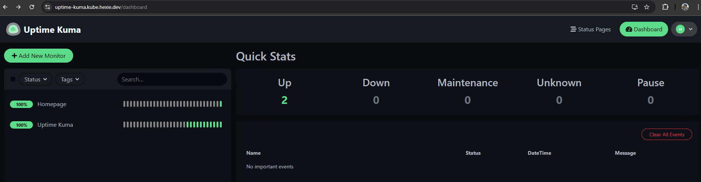

# --- homelab-k3s ---

Migration of my homelab from Docker Compose to Kubernetes (k3s), running on Proxmox VE.

The Docker Compose version of this homelab lives at [hexiejexie/homelab](https://github.com/hexiejexie/homelab) and continues to run in parallel during the migration.

## why migrate

The Docker Compose homelab has been running stably for years and there is nothing wrong with it. This migration is driven by three goals:

1. Learn Kubernetes properly by running it as the primary platform for real workloads, not as a tutorial.
2. Build out a GitOps workflow with Flux so that the cluster state is reconciled from Git rather than from imperative `docker compose up` commands.
3. Add genuine, deep Kubernetes experience to my CV by shipping a 40+ service production-style migration end to end.

## cluster

Single-node k3s running on a dedicated Proxmox VM. The existing Docker LXC stays online and serves all production traffic until each service has been migrated and verified on k3s.

| Component | Detail |
|---|---|
| Distribution | k3s (CNCF-conformant Kubernetes) |
| Host | Proxmox VM (4 vCPU, 8 GB RAM) |
| Ingress | Traefik (bundled with k3s, configured for Cloudflare DNS challenge) |
| Storage | local-path-provisioner (Longhorn planned later) |
| DNS | AdGuard Home rewrite for `*.kube.hexie.dev` pointing to the k3s node |
| Certificates | Let's Encrypt via Cloudflare DNS challenge |

## repo structure

homelab-k3s/
├── infrastructure/        Cluster-level resources
│   ├── traefik/           HelmChartConfig overrides + Cloudflare token
│   ├── cert-manager/      (planned)
│   └── longhorn/          (planned)
├── apps/                  Application workloads grouped by function
│   ├── apps/              Homepage, Mealie, Paperless, etc.
│   ├── arr/               Sonarr, Radarr, Prowlarr, qBittorrent, etc.
│   ├── games/             Crafty, Terraria
│   ├── media/             Jellyfin, Jellyseerr
│   ├── monitoring/        Uptime Kuma + AutoKuma, Prometheus, Grafana
│   └── network/           AdGuard, Vaultwarden, WireGuard
├── namespaces/            Namespace definitions for the above groups
└── docs/                  Screenshots and reference material

Each service directory contains its own manifests: `pvc.yaml`, `deployment.yaml`, `service.yaml`, `ingressroute.yaml`, optionally `secret.yaml`, `rbac.yaml`, and `kuma-monitor.yaml`. Secrets are gitignored and applied locally.

## service patterns

Every service is built from the same set of building blocks, mirroring what was previously done with YAML anchors in Docker Compose:

* `Deployment` for the workload (replaces the `services:` block)
* `Service` for in-cluster discovery (replaces Docker network resolution)
* `PersistentVolumeClaim` for state (replaces bind mounts)
* `IngressRoute` (Traefik CRD) for external HTTPS (replaces Traefik labels)
* `Secret` for sensitive env vars (replaces `.env` files)
* `KumaEntity` for uptime monitoring (replaces AutoKuma's Docker label discovery)

This mapping is the core mental model and is the same regardless of which service is being migrated.

## migration status

Services are migrated in waves. Each one has to run cleanly on k3s with TLS, monitoring, and persistent state before being marked complete.

### migrated

* Homepage
* Uptime Kuma
* AutoKuma

### in progress

* (none currently)

### pending

All other services haha

## roadmap

| Phase | Goal |
|---|---|
| 1 | Foundation: k3s up, Traefik configured, first service deployed (done) |
| 2 | Migrate stateless and lightweight services (in progress) |
| 3 | Migrate the media and Arr stacks with shared volume access to the 18 TB array |
| 4 | Migrate stateful services (Authentik, Immich, Vaultwarden, Paperless) |
| 5 | Move shared boilerplate into a `homelab-service` Helm chart |
| 6 | GitOps: FluxCD reconciling the cluster from this repo |
| 7 | Storage: migrate from local-path to Longhorn for replication and snapshots |

## screenshots

Uptime Kuma showing both the Homepage and Uptime Kuma monitors green, with KumaEntity-driven discovery via AutoKuma:

## related

* [hexiejexie/homelab](https://github.com/hexiejexie/homelab): the original Docker Compose homelab still in production.
* [hexie.dev](https://hexie.dev): personal site and blog.
* [imeanit.nl](https://imeanit.nl): freelance IT consultancy.